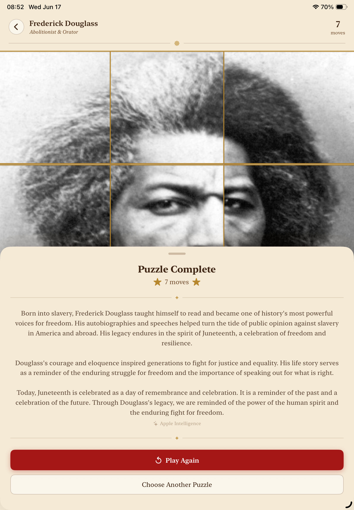
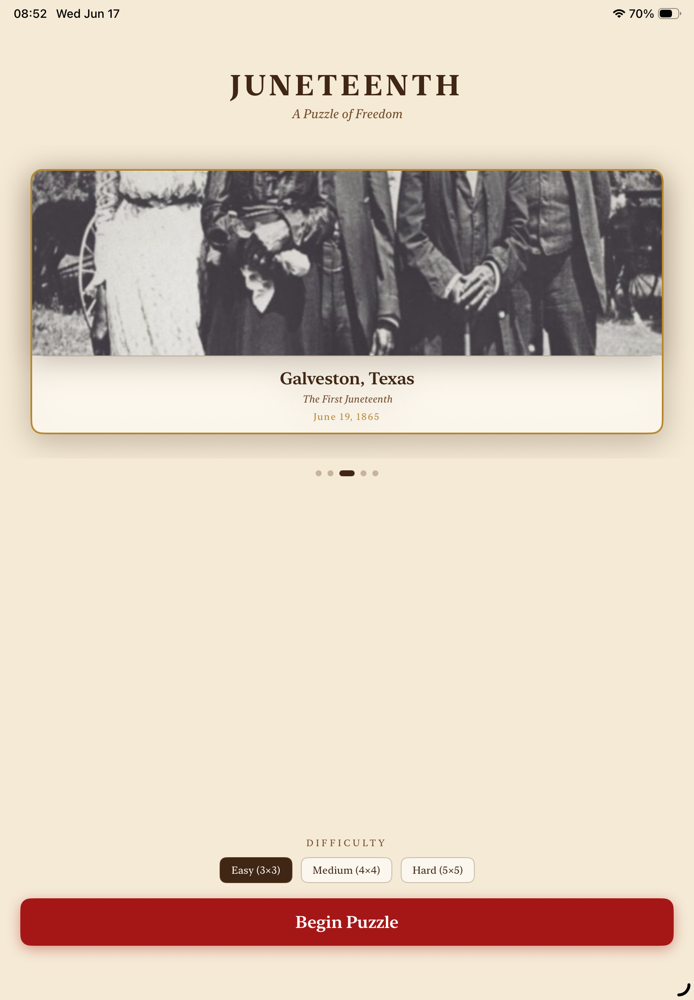

# Juneteenth Puzzle

A sliding-tile puzzle iOS app that celebrates Juneteenth — the day freedom was finally proclaimed across America. Each puzzle is built around a historical figure or moment from Black American history, and solving it unlocks a story.

Built for the [DEV June Solstice Game Jam 2026](https://dev.to/challenges/june-game-jam-2026-06-03) and as a personal portfolio project for Apple Developer Academy Binus.

---

## What it does

You solve a classic 3×3 sliding tile puzzle. The image you're unscrambling is a portrait or scene tied to Juneteenth history — Frederick Douglass, Harriet Tubman, the first Juneteenth in Galveston, Sojourner Truth, or the Juneteenth flag.

When you finish, the app shows how many moves it took and surfaces a short historical note about the subject. On devices running iOS 26 with Apple Intelligence, an on-device AI narrator generates a richer, streaming story — no internet connection required, no API keys.

---

## Screenshots

| Puzzle selection | Solving the puzzle | Completion + history |
|---|---|---|
|  |  |  |

**Demo video:** [Watch gameplay (MP4)](docs/screenshots/demo.mp4)

---

## Historical subjects

| Subject | Role | Year |
|---|---|---|
| Frederick Douglass | Abolitionist & Orator | 1818 – 1895 |
| Harriet Tubman | Underground Railroad conductor | c. 1822 – 1913 |
| Galveston, Texas | The first Juneteenth | June 19, 1865 |
| Sojourner Truth | Abolitionist & Suffragist | c. 1797 – 1883 |
| The Juneteenth Flag | Symbol of freedom | Designed 1997 |

---

## Features

- **Sliding tile puzzle** — classic 3×3 mechanics, move counter, solvable-only shuffles
- **Historical cards** — five subjects, each with a portrait and curated historical note
- **AI Historical Narrator** — on iOS 26+ with Apple Intelligence, an on-device language model streams a richer narrative after each solve (falls back gracefully on older OS)
- **iPhone & iPad** — supports both form factors, iOS 16+
- **No accounts, no internet, no trackers** — everything runs on device

---

## Tech

- Swift / SwiftUI — pure Apple stack, no third-party dependencies
- `FoundationModels.framework` (iOS 26) — on-device Apple Intelligence for the AI narrator
- XcodeGen (`project.yml`) for reproducible project generation
- Target: iOS 16+, enhanced on iOS 26

---

## Running it

1. Clone the repo
2. Open `Juneteenth.xcodeproj` in Xcode 16+
3. Select your device or simulator
4. Build & run (`Cmd+R`)

> The AI narrator feature requires a physical device running iOS 26 with Apple Intelligence enabled. The rest of the app works on any iOS 16+ device or simulator.

---

## About

Solo project by Clement Lumumba. Built to combine something I care about — preserving and sharing Black history — with SwiftUI skills I'm growing at Apple Developer Academy Binus. The AI layer was an experiment in using on-device Apple Intelligence to add depth without compromising privacy.

Work in progress.
